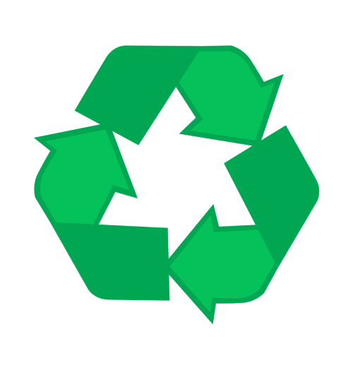
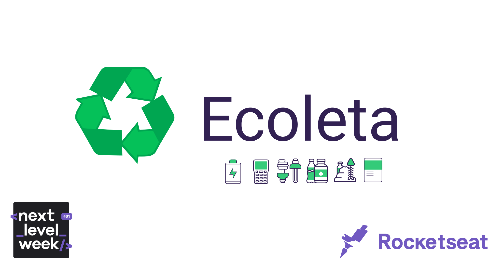
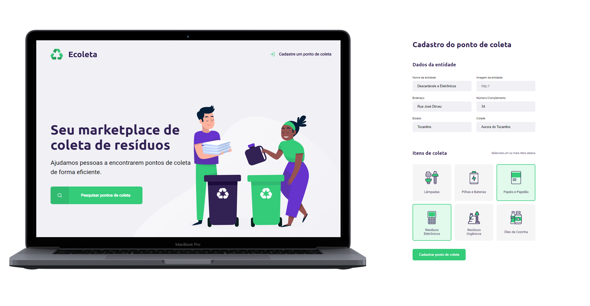
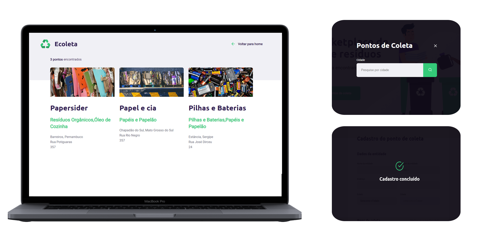

<h1  align="center">

</h1>

<p  align="center">

</p> 

<h4  align="center">
	♻ Ecoleta
</h4>

  
<p  align="center">
<a  href="#telescope-projeto">Projeto</a>&nbsp;&nbsp;&nbsp;|&nbsp;&nbsp;&nbsp
<a  href="#computer-tecnologias"> Tecnologias</a>&nbsp;&nbsp;&nbsp;|&nbsp;&nbsp;&nbsp;
<a  href="#-preview">Preview</a>&nbsp;&nbsp;&nbsp;|&nbsp;&nbsp;&nbsp;
<a  href="#-getting-started">Getting Started </a>
</p>

 

## Projeto
 
<b>Ecoleta</b> foi a aplicação desenvolvida durante a Next Level Week, evento realizado pela [Rocketseat](https://rocketseat.com.br/). <p>Este projeto é da trilha <b>starter</b></p>
  

## Tecnologias
- HTML
- CSS
- Javascript

**API**

- [NodeJs;](https://nodejs.org/en/)

**Template Engine**

- [Nunjucks;](https://medium.com/@andy.neale/nunjucks-a-javascript-template-engine-7731d23eb8cc])

**Database**

- [Sqlite](https://www.sqlite.org/index.html)

Estamos utilizando as API's de localidade da <b>IBGE</b>:
 - [UF's](https://servicodados.ibge.gov.br/api/docs/localidades?versao=1#api-UFs-estadosGet)
 - [Munincípios por UF](https://servicodados.ibge.gov.br/api/docs/localidades?versao=1#api-Municipios-estadosUFMunicipiosGet)
 
##  Preview

<p  align="center">
	
</p>

<p  align="center">
	
</p>

## Getting Started

Você precisa clonar o repositório, e pode fazer isso digitando em seu terminal `$ git clone https://github.com/lucaszarza/Ecoleta.git`.
 
### API

Logo após clonar o repositório execute o comando ou `npm install`.

Depois das de terminar de instalar as dependências, execute o comando `npm start`

Então acesse o navegador com [http://localhost:3000/](http://localhost:3000/)

```
[SERVER] Server is running in port 3000
```

--- 

<h5 align="center"> Ecoleta made by Lucas Zarza</h5>

---
